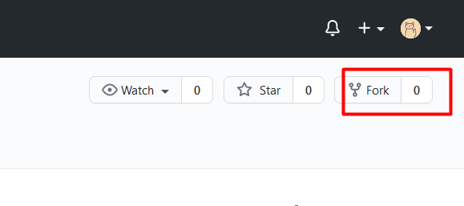
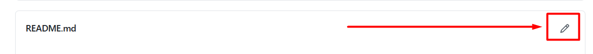
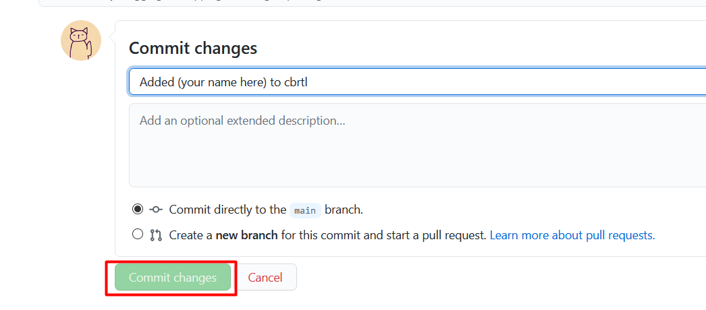
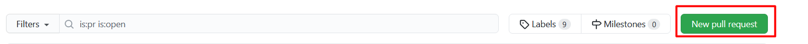

# Official Member's list of cbrtl.

## Table of Contents
- [cbrtl members](##cbrtl-members)
- [Adding yourself as a member](##adding-yourself-to-the-members-list)

This repository exists to document the members of cbrtl community.
To add yourself to the member's list you can either make a Pull Request to this repository, or
ping one of the org maintainers on the discord server.

## cbrtl members.
| Member name                                             | Member Profile picture                                                                                                            | Bio (optional)                                                   |
| ------------------------------------------------------- | --------------------------------------------------------------------------------------------------------------------------------- | ---------------------------------------------------------------- |
| [Srijan Paul](https://github.com/srijan-paul)           |                                                    | Typescript, PL dev, Lua and pixel art :)                         |
| [Nikola Jelic](https://github.com/NikolaJelic)          |                                                     | N/A                                                              |
| [Manohar Pattanayak](https://github.com/manoharbabun)   |  | Web developer and Freelancer who loves to contribute open source |
| [Ankur Khandelwal](https://github.com/Ankur-Khandelwal) |                                                   | Web Dev ｜ MERN ｜ Flutter ｜ The Big Bang Theory                |
| [Hentai Chan](https://github.com/hentai-chan)           |                                                   | Python and C++ developer in the making ｜ based in Europe        |
| [Shikha-Pika](https://github.com/Shikha-Pika)           |                                                     | N/A                                                              |
| [Sambit Majhi](https://github.com/sambitraze)           |                                                     | MERN, Django, Python | Love to build cool projects |
| [Aniket Shukla](https://github.com/aniket1404)          |  | N/A   |

| [E Swarup Kumar](https://github.com/eswarupkumar)       |  | MERN, Django, Python | Love building cool projects.
           
## Adding yourself to the member's list.

**NOTE:** If you're already familiar with Git and GitHub, then you don't have to do this, as it's mostly to introduce newbies.
You can directly ping a moderator on the Discord server and you will be added.

We expect basic knowledge of Git and Github for you to be able to pull this off.
If you don't know how to use git, then don't worry. Atlassian has a some [great tutorials](https://www.atlassian.com/git/tutorials) on the topic.

1. Fork this repo. This should create an identical repository on your profile.


  - > Now you want to edit the README and add yourself. There are two ways to do this, by using the GitHub web editor or by cloning to your local PC. We recommend the second way if you're new to Git. But this README will only explain the simpler and shorter method.

2. On your fork of the repo, click on the edit icon to edit the `README` file.


3. Now scroll down to the list of members, it should be in a tabular format. Append the following lines at the end:
```

[Your name](your github profile link) |   | (Your Bio here, add N/A if None)  
```

4. Add a meaningful commit message and click commit:


5. Come back to the original repo (this one), go to the `Pull Requests` section and click `New Pull Request`.


6. Write a short title and description for the PR and click "Make Pull Request".

7. Wait for someone in the organization to review and merge the PR and you're in. (or you can ping the mods on discord if you're in a hurry).

8. You're done :)


